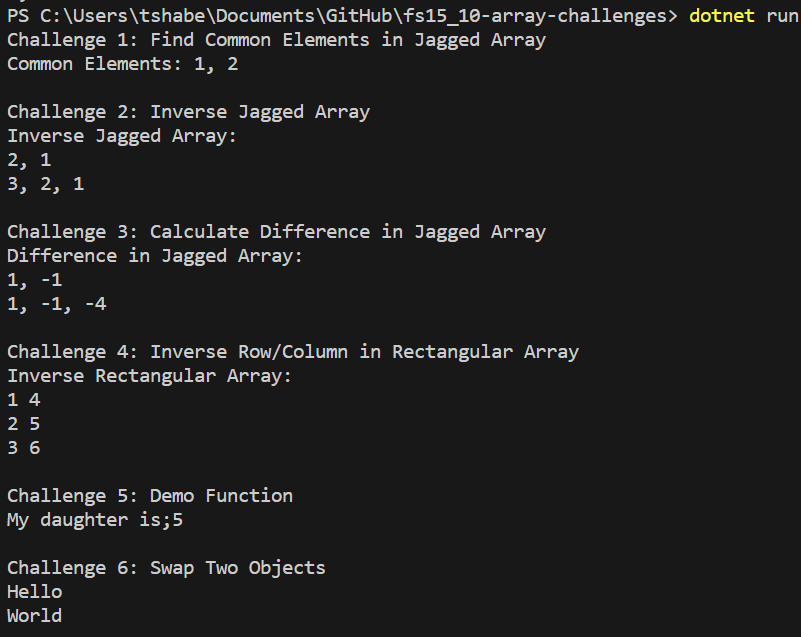
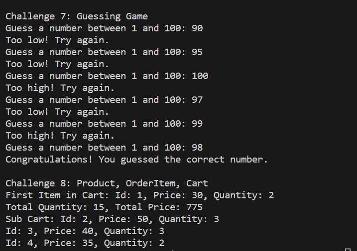

# Array challenges

Check requirements for each challenge in `Program.cs`

## Test your output

Run `dotnet run` or `dotnet watch` to execute your codes
## Challenge 1: Find Common Elements in Jagged Array

Description: Given a jagged array of integers, find the common elements in the nested arrays.

        bash Input: int[][] arr1 = { new int[] { 1, 2 }, new int[] { 2, 1, 5 } };
        Output: Common Elements: 1, 2

## Challenge 2: Inverse Jagged Array

Description: Inverse the elements of a jagged array.

        Input: int[][] arr2 = { new int[] { 1, 2 }, new int[] { 1, 2, 3 } };
        Output:
        Inverse Jagged Array:
        2, 1
        3, 2, 1

## Challenge 3: Calculate Difference in Jagged Array

Description: Find the difference between 2 consecutive elements of each array in a jagged array.

        Input: int[][] arr3 = { new int[] { 1, 2 }, new int[] { 1, 2, 3 } };
        Output:
        Difference in Jagged Array:
        1, -1
        1, -1, -1 

## Challenge 4: Inverse Row/Column in Rectangular Array

Description: Inverse the columns and rows of a rectangular array.

        Input: int[,] arr4 = { { 1, 2, 3 }, { 4, 5, 6 } };
        Output:
        Inverse Rectangular Array:
        1, 4
        2, 5
        3, 6 

## Challenge 5: Demo Function

Description: Write a function that accepts a variable number of parameters of any type (string or number) and performs a specific action.

        Input: Demo("hello", 1, 2, "world");
        Output: hello world;3
## Challenge 6: Swap Two Objects

Description: Write a function to swap two objects but only if they are of the same type and meet certain conditions.

        Input/Output: The output will depend on the values of obj1 and obj2 and their types. 
## Challenge 7: Guessing Game

Description: Write a function that implements a guessing game where the user needs to guess a random number generated by the program.

        Input/Output: The interaction will happen through the console, and the output will depend on the user's input and the generated random number.
## Challenge 8: Product, OrderItem, Cart

Description: Implement a store feature using classes Product, OrderItem, and Cart to manage products, quantities, and prices in a shopping cart.
Input/Output: The output will depend on the operations performed on the Cart object and the specific actions called on it. The output will be displayed through the console.
Please note that these examples provide an overview of the input and output for each challenge, but the complete program execution may have additional details and user interactions.

## Sample Output

---

---